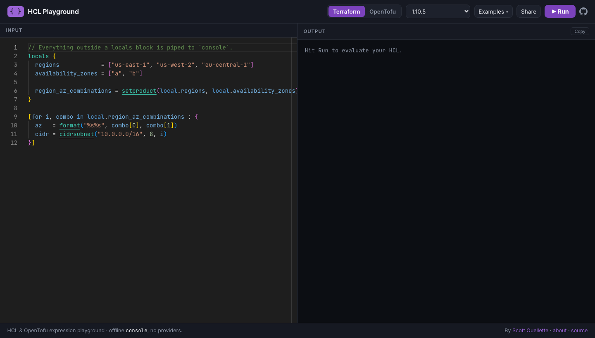

# HCL Playground

Evaluate **HCL** expressions in your browser with **Terraform** or **OpenTofu** —
no install, no project, no `init`/`console` loop. Type an expression, hit Run.



<!-- TODO: replace the screenshot above with a fresh demo video/GIF -->

## Description

HCL Playground is an application designed to provide a playground/sandbox environment for evaluating HashiCorp Configuration Language (HCL) code on-demand, with **Terraform** or **OpenTofu**.

### Security model

User input is run through `<engine> console` in a deliberately locked-down way:

- **No shell.** Commands run as argv lists (`shell=False`); the engine/version is
  validated against pre-installed binaries and never interpolated into a command.
- **Expression-eval only / offline.** Only `locals` blocks and console
  expressions are accepted — `provider`/`resource`/`data`/`module`/`backend`
  blocks and filesystem functions (`file()`, `templatefile()`, …) are rejected,
  and `init` runs with `-backend=false`. With the egress-denying `NetworkPolicy`,
  evaluation has no network and can't read container files.
- **Bounded.** Per-run timeout + CPU/file/process rlimits; request size capped;
  pod runs non-root, read-only root FS, all caps dropped, with CPU/memory limits.
- **No reflection.** Evaluation is an async JSON API (`POST /evaluate`); code is
  never echoed into HTML/JS (no XSS), and the endpoint is JSON-only (CSRF-resistant).

Engine versions are baked into the image at build time (`TF_VERSIONS` /
`TOFU_VERSIONS` build args); the installed set is the runtime allowlist.

The aim of this project is avoid the [toil/overhead required to simply evaluate some HCL-code](https://github.com/hashicorp/terraform/issues/24094#issuecomment-1825482867) where a user currently has to:
- Install terraform
- Setup a new project
- Write some HCL
- `terraform init`
- `terraform console`
- < test how [setproduct()](https://developer.hashicorp.com/terraform/language/functions/setproduct) works on your current `locals` data >
- "Oops I made a mistake!"
- `Ctrl+C`
- edit `locals` block
- `terraform console`
- rinse and repeat

If you've been in the depths of attempting to get "creative" with cobbling together the terraform functions available to massage some complex inputs you may catch my drift

## Getting Started

### Prerequisites

- Docker installed on your local machine
- Git (for cloning the repository)

### Run it (one command)

```bash
make run        # build + run on http://localhost:8080
```

That's it — it's a single stateless container. `/scratch` is an ephemeral
per-request work area inside the container, so there's no volume/DB/cluster to
set up.

Other targets:

```bash
make secure     # run with container hardening (read-only fs, dropped caps, mem/pid limits)
make test       # build with dev deps and run the unit tests in the container
make e2e        # run Cypress against a running instance (start `make run` first)
```

Engine versions are baked in at build time; override with build args:

```bash
docker build --build-arg TF_VERSIONS="1.9.8 1.8.5" \
             --build-arg TOFU_VERSIONS="1.8.5 1.7.3" -t hcl-playground .
```

## Authors

- **Scott Ouellette** - *Initial work* - [scottx611x](https://github.com/scottx611x)

## License

This project is licensed under the MIT License - see the [LICENSE.md](LICENSE.md) file for details
